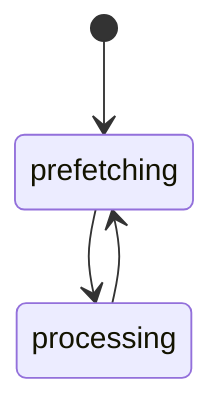
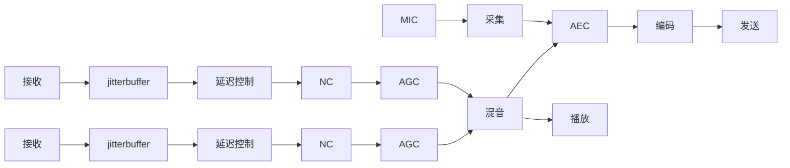
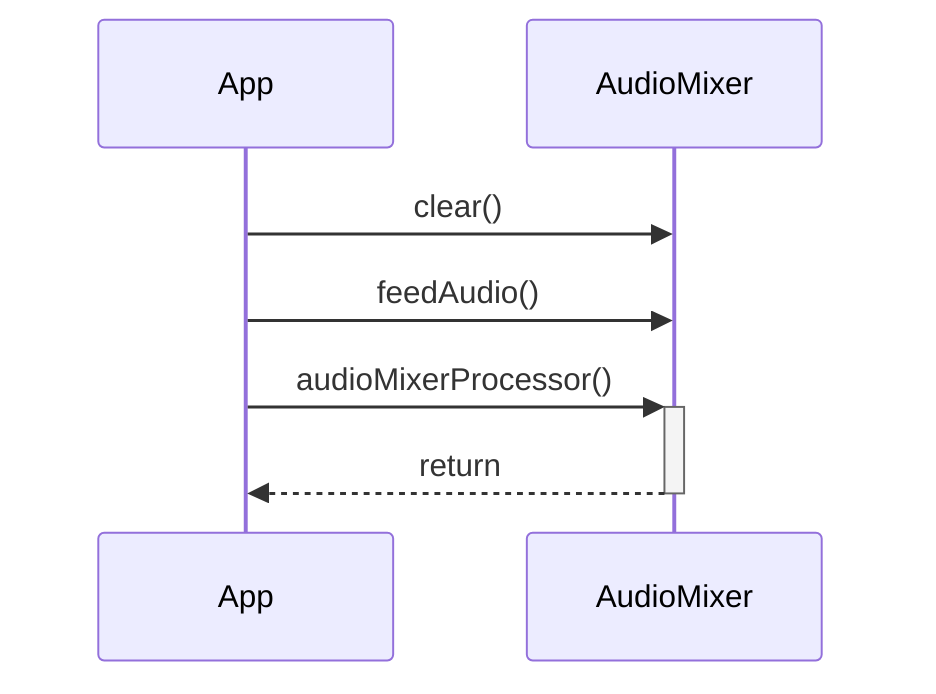
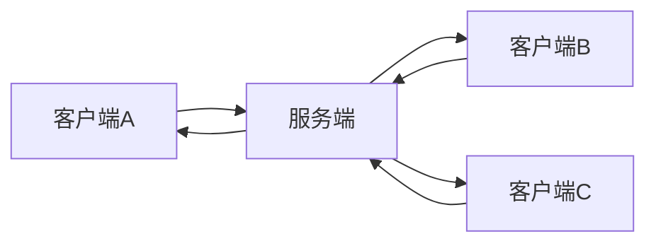

# WEB中实现音频实时通信
在浏览器中实现实时音频通话，除了WEBRTC的另一种实现。

## 音视基础知识介绍
### 什么是PCM
PCM 即脉冲编码调制 (Pulse Code Modulation)。在PCM 过程中，将输入的模拟信号进行采样、量化和编码，用二进制进行编码的数来代表模拟信号的幅度；接收端再将这些编码还原为原来的模拟信号。即数字音频的 A/D 转换包括三个过程 ：采样，量化，编码。 
### 音频采样概率
采样定理是E.T.Whittaker(1915)、Kotelnikov(1933)、Shannon(1948)提出的，在数字信号处理领域中，采样定理是连续时间信号（通常称为“模拟信号”）和离散时间信号（通常称为“数字信号”）之间的基本桥梁。该定理说明采样频率与信号频谱之间的关系，是连续信号离散化的基本依据。 它为采样率建立了一个足够的条件，该采样率允许离散采样序列从有限带宽的连续时间信号中捕获所有信息。
### 采样率与采集声音频率的关系
在进行模拟/数字信号的转换过程中，当采样频率fs.max大于信号中最高频率fmax的2倍时(fs.max>2fmax)，采样之后的数字信号完整地保留了原始信号中的信息，一般实际应用中保证采样频率为信号最高频率的2.56～4倍；采样定理又称奈奎斯特定理。
### opus音频编码介绍
#### 什么是音频编码
opus是一种有损的声音编码格式，音频编码是对音频采样数据的一种压缩算法。
#### opus编码的特点
低码率的情况下有较好的音质表现，适用于实时语音通信的场景。
#### 音频主要参数介绍
##### 采样率
对模拟信号进行数字采样的频率。常见的采样率有8k 16k 32k 44.1k 48k。通话中通常采用8k的采样率，因为人类说话声音频率较低，音乐和与乐器通常用48k 和 44.1k这样可以保留更多的高频声音。
##### 声道
表达同一个声音，不同空间位置的采样结果。语音通话的场景一般使用单声道即可。
##### 采样位宽
表达了声音采样的精度。如参见的8bit 16bit 和 32bit，如8bit 表示用一个AD转化后通过8bit数据来存储该采样点，那么它的采样精度就是0-255。
#### 音频混音如何实现
两个声音信号在时域叠加,混音的前提条件是具备相同的采样率和采样位宽，所以混音前需要做采样率和采样位宽的转化，实现一致性。
##### 自适应加权混音算法介绍
混音算法核心要点是不能让声音溢出，同时又希望声音不能过大的衰减。

A<0 and B<0
$outpu = A+B+\frac{A*B}{32767}$
else
$output = A+B-\frac{A*B}{32767}$

这个是一个目前较流行的混音计算函数，实现自适应衰减，避免了混音后声音溢出。
当A与B都很大的时候，音频衰减就很大，A与B很小的后衰减就很少

#### 音频重采样
##### 什么是音频混叠
从采样定理我们可以知道，只有当采样率大于声音频率的两倍时，我们才可以获得该声音的完整信息。当我们进行声音重采样的时候，如果我们从高采样率向低采样率转化的时候，由于低采样率已经无法表达高频信号，导致高频信号能量错误的表达成了低频信号，出现了音频混叠。音频混叠会破坏低频信号。所以我们在音频从采样前需要首先进行低通滤波，滤除无法表达的高频信号。
##### 音频重采样的主要步骤
对声音信号进行平滑、均匀的插值或抽值。

三次样条插值法
分段通过3阶函数实现插值，这样可以实现分段间光滑衔接。

##### 基音与泛音
在我们欣赏乐器的时候，我们常常能够准确的分辨出时钢琴、小提琴、还是二胡。弹奏乐器的时候我们有着相同的频率变化，为什么我们能够区分不同的乐器呢。我们主要频率是基音，泛音是各种不同频率信号组成，跟不同发声过程有关的信号，它代表了声音的音色。
#### 变速不变调
识别基音位置，增加基因周期或删除基音周期，实现变速不变调。
基音识别算法介绍
平均幅度差函数（AMDF）实现基音周期的识别。
#### 音频时域信号与频域信号的介绍
- 时域：自变量是时间，即横轴是时间，纵轴是信号的变化（振幅）
- 频域：自变量是频率，即横轴是频率，纵轴是该频率信号的幅度（振幅）

我们可以认为时域信号是，多种不同频率的信号在时域的叠加。在频域我们将声音拆分成不同频率的信号，降低了信号处理的复杂度。


## 技术选型
 - socket.io
 - rtp/rtcp协议介绍
 - JavaScript

## 在WEB中实现实时音频通信的优缺点
由于TCP拥塞算法的问题，导致在实时通信中TCP有着天然的劣势。但是对于WEB环境，如果我们不用WEBRTC那么我们就只能通过websocket实现通信（TCP）。那就得谈谈它的优缺点。
### 优点
 - 报文有序
 - 报文不会丢包
  
### 缺点
 - 队头阻塞（在多路复用中有着天然的劣势）, 底层协议基于TCP，当某个报文丢包后，后续报文在该报文完成重传前都会被阻塞。

## jitterbuffer
在voice over IP(VoIP)中，抖动缓冲器是一个共享的数据区域，在这个数据区域中，每隔一段均匀的间隔，语音包会被收集，存储并发到语音处理器。包到达时间的变化，称作抖动，将会由于网络拥塞，定时漂移或路由变更而产生。抖动缓冲器放于语音连接的接收端，它有意地延迟到达的包，如此一来，终端用户就会感受到一个清晰的，没有什么声音失真的连接。抖动缓冲器有两种，静态的和动态的。
### 什么是网络抖动
抖动是为了表达网络发生拥塞，延迟的变化。
### jitterbuffer如何处理网络抖动

prefetching 与 processing

prefetching：只缓存不播放
processing： 可缓存也可以播放


jitterbuffer状态机



### 固定缓冲
设定一个固定且足够大的缓冲区实现消抖，设置固定prefetching缓冲区。

### 自适应缓冲
如何估计网络抖动
发送端固定间隔发送 -- 计算接收端抖动 -- 设置缓冲区大小

接收端统计前100个报文的最大接收间隔，作为prefetching缓冲区。 

需提前配置最大prefetching缓冲区和最小prefetching缓冲区。


## 回声消除
### 声学回声形成和影响
近端的声音被麦克风拾取后通过网络传输到远端，远端扬声器播放出来的声音被麦克风拾取后通过网络又重新发回近端，使得近端从扬声器中听到自己声音，形成了回声。
### 概述回声消除原理
近端声音实现对远端声音的自适应匹配，匹配后滤除远端声音，从而实现回声消除。
### webrtc回声消除模块使用介绍
通过webassembley的方式对webrtc AEC模块进行编译。实现在浏览器的调用和使用。

## 噪声消除
### 噪声消除基本原理
通过相关算法实现噪声估计，并从原音频中滤除噪声信号。

### webrtc噪声消除模块使用介绍
 通过webassembley的方式对webrtc NC模块进行编译。实现在浏览器的调用和使用。

## 动态增益
 - 声音分贝计算
数字信号中，以声音的最大振幅为声音响度计算的参考基准，所以数字信号中最大声音为0dB
$db=10log(\frac{声音能量值}{参考声音能量值})$
 - 动态增益基本原理
  评估声音响度  --  平滑的将声音响度提升或降低到预设的声音响度。    
 - webrtc动态增益模块使用介绍
 通过webassembley的方式对webrtc AGC模块进行编译。实现在浏览器的调用和使用。

## 如何实现延迟控制
### 如何实现低延迟缓冲
通过jitterbuffer根据网络情况实现缓冲区自适应调整，实现当前网络情况下的低延迟缓冲。
### 什么时候加减速播放
当jitterbuffer缓存大于某值的时候加速播放(预设一个配置值 需要大于最大prefeching)

当jitterbuffer缓冲小于某值的时候减速播放
小于prefeching的时候减速播放

## WEB实时语音总体软件架构介绍
WEB实时语音总体功能结构图



### 音频采集播放
web音频采集和播放接口介绍
### jitterbuffer实现

js实现缓冲队列

### 音频编解码
opus编码库的使用
### 音频重采样
重采样库的实现


### 回声消除实现

### 音频混音


## WEB实时语音服务端实现
### 基础信令实现
#### 连接
socket.io 连接
#### 登入
实现语音接入
#### 断开
实现语音断开

### 音频数据转发实现
无脑向发送端外的其他客户端转发。



## 如何接入其他音视频服务器
### SRS简单介绍
SRS(Simple Realtime Server)是一个简单高效的实时视频服务器，支持RTMP、WebRTC、HLS、HTTP-FLV、SRT等多种实时流媒体协议。

### 通过FFMPEG转发
- 如何通过ffmepg将音频数据转发到srs服务器实现对外直播 -- 通过pipe向ffmpeg 进程发送音频数据，ffmpeg 通过RTMP协议推送到SRS服务器。
```
ffmpeg -f f32le -ar 16k -ac 1 -i - -vn -c:a aac -ar 44100 -f flv -y url
```
